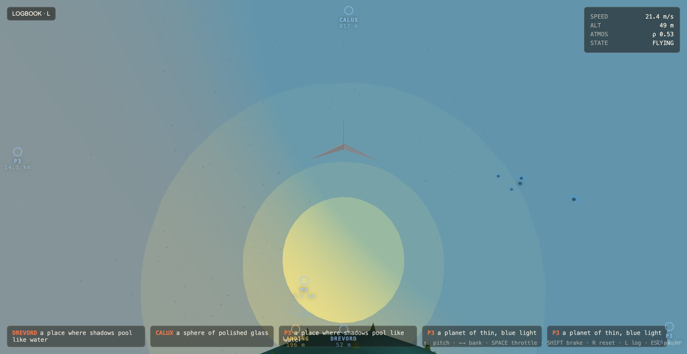

# Personal Space

A single-player browser game: pilot a paper airplane through an LLM-coauthored procedurally generated universe. Tiny planets at Le Petit Prince scale, an LLM names the places you find, and a cloud-backed logbook preserves every world you've claimed — thumbnail, lore, and flight stats — across devices.



## Run it locally

```
npm install
npm run dev
```

Open the URL Vite prints (defaults to `http://127.0.0.1:5173`). The game runs fully offline — without an LLM worker configured it falls back to deterministic placeholder names and teasers, and the logbook degrades to local-only.

For the full experience (LLM naming + cloud logbook) you also need the worker running. In a second terminal:

```
cd worker && npm install && npm run dev
```

The Vite dev server proxies `/api/*` and `/tier*` to `localhost:8787`, so cookies flow as same-origin and you can sign up with a passkey on `127.0.0.1:5173` without any cross-origin gymnastics. See [`worker/README.md`](worker/README.md) for the one-time Cloudflare setup (D1, R2, KV namespaces, secrets).

## Controls

| Key | Action |
| --- | --- |
| ↑ / ↓ | Pitch (flight-sim convention: ↑ = nose down) |
| ← / → | Bank (left / right) |
| `SPACE` | Held throttle. Also tap-to-takeoff when grounded |
| `SHIFT` | Brake |
| `L` | Toggle logbook |
| `R` | Reset to spawn |
| `ESC` | Pause |

The `LOGBOOK` and `ACCOUNT` buttons sit in the top-left of the HUD. Logbook entries are click-able for a detail view (thumbnail + full lore + landmarks + flight stats).

## What's in here

```
src/
  main.js                    Bootstrap, fixed-step loop, glue
  game/
    GameLoop.js              60Hz fixed timestep with accumulator + pause
    Input.js                 Keyboard handling
    Plane.js                 Rapier ball body + paper plane mesh
    FlightController.js      Kinematic cruise + attitude
    FlightStats.js           Per-attempt top speed / distance / crashes / time-to-land
    Aero.js                  Orbital tracking and auto-roll math
    CameraRig.js             Atmosphere/space chase camera with blend
    Tuning.js                All flight + LLM tuning constants
  world/
    Galaxy.js                Sparse hash grid; streams systems in and out
    SolarSystem.js           Sun + 3–6 planets, each with atmosphere + pad
    Planet.js                Subdivided icosahedron + trimesh collider
    TerrainGen.js            Multi-octave value noise displacement
    Atmosphere.js            Translucent shell + rho function
    LandingZone.js           Runway, beacon, terrain flattening, claim trigger
    Landmarks.js             Hero spire picks from elevation peaks
    Features.js              ~1200 instanced rocks + flora per planet
    Origin.js                Floating-origin rebasing (5km threshold)
    Seed.js                  Mulberry32 PRNG + value noise
  ui/
    HUD.js                   Speed/alt/atmos readout + ping strip
    PlanetNav.js             Edge-clamped nav rings with distance labels
    Toast.js                 Centered transient text + flash
    Logbook.js               Slide-out drawer; list + detail view; sync dots
    AccountDrawer.js         Right-side drawer; sign-in / export / delete
    AuthModal.js             Passkey + email-link sign-up flow
    DebugHUD.js              Top-left telemetry overlay
  llm/
    LLMClient.js             Tiered scheduler, in-flight dedupe, LS cache
    Prompts.js               Tier 1/2/3 prompt assembly
    Placeholder.js           Deterministic offline fallback
  auth/
    AuthClient.js            Anonymous-by-default session bootstrap
    Upsell.js                3rd-claim "save your logbook" nudge
  logbook/
    LogbookStore.js          IDB-backed outbox; identity-tuple dedupe
    LogbookSync.js           Background flusher; exponential backoff
    ThumbnailCapture.js      Offscreen WebGLRenderTarget at claim time
    migrate.js               One-shot localStorage → IDB upgrade
    idb.js                   Tiny IndexedDB wrapper (zero deps)
  net/
    api.js                   fetch wrapper with credentials + typed errors
public/
  privacy.html               Static "what we store" page
worker/                      Cloudflare Worker (Hono + D1 + R2 + KV + Resend)
docs/plans/                  Implementation plans
plan.md                      Running roadmap (source of truth)
```

## How the world is built

- **Galaxy** is a sparse hash grid keyed by `floor(galaxyCoord / CELL_SIZE)`. Cells are deterministically occupied from the galaxy seed; systems spawn within `SPAWN_RADIUS` of the player and despawn beyond `CULL_RADIUS`. The home cell `(0,0,0)` is always populated so spawn is stable.
- **Solar systems** place a sun at their origin and 3–6 planets at log-spaced orbits (200m–5km) using sector-based angular distribution plus inclination jitter — planets never line up.
- **Planets** are subdivided icosahedrons displaced by multi-octave noise, with a trimesh Rapier collider built from the deformed mesh. Vertex colors are banded by elevation; one runway per planet flattens the surrounding terrain into a tangent disc before the collider is built, so visuals and collisions agree.
- **Floating origin** kicks in once the plane drifts >5km from render `(0,0,0)`. Every active body — plane, planets, atmospheres, sun — is shifted by the same delta between fixed steps so render coords stay near zero indefinitely.

## How naming works

A tiered LLM scheduler keeps prompts cheap and responsive:

- **Tier 1 (Haiku)** — fires on system spawn, one per planet. Returns a one-line teaser; cheap enough to do for every planet in view.
- **Tier 2 (Sonnet)** — commitment-gated. Per fixed step, for each not-yet-named planet, fires once when you're inside its atmosphere *or* aimed at it (`dot(fwd, toPlanet) ≥ 0.85`) within `radius + 1500m`. Returns name, biome, palette, landmark names.
- **Tier 3 (Sonnet, more tokens)** — fires when you actually claim the pad. Returns surface lore that goes into the logbook entry (and a one-time HUD fly-out).

Cache key is `(tier, seed, normalizedContext)`, so revisiting any planet returns identical content. With a worker, the cache lives in Workers KV; without one, it lives in `localStorage` under `paper-airplane:llmcache:v1`.

## Accounts & logbook

The logbook is a cloud-backed memoir of every planet you've claimed — captured at the moment of landing and preserved forever, across devices, with no obligation to remember a password.

**Anonymous by default.** On first launch the game silently mints a server-side anonymous user and a session cookie. You can claim planets immediately; entries sync in the background.

**Sign up to keep them.** After the 3rd claim a small banner offers to attach your anonymous run to a real account. Two paths:

- **Passkey** (recommended) — your device's fingerprint, face, or PIN. No password. Built on WebAuthn via [`@simplewebauthn/server`](https://simplewebauthn.dev/) and [`@simplewebauthn/browser`](https://simplewebauthn.dev/).
- **Email magic link** — enter your email, get a one-time sign-in link via [Resend](https://resend.com/). Useful for recovering on a new device.

Either way, the upgrade is in place — your existing anonymous entries stay attached to the same user id. Cross-device sign-in merges anonymous claims into the known user by the planet identity tuple (`galaxy_seed, cell_x, cell_y, cell_z, planet_index`), with the server enforcing UNIQUE-on-tuple to dedupe.

**What's captured per entry:**

- Planet identity tuple + planet name + biome + palette
- Full Tier 3 surface lore + landmark blurbs (lore arrives async; the entry persists immediately with `lore_status: pending` and is patched once the LLM resolves)
- 512×512 JPEG thumbnail captured offscreen with a settle-window (waits for the plane to be grounded with `|v| < 1 m/s` for half a second; falls back at 4s)
- Per-attempt flight stats: top speed, distance flown (integrated from velocity so floating-origin rebases don't reset it), time to land, crashes during this attempt

**Where it lives:**

- **D1** for the relational rows (users, sessions, passkeys, email tokens, entries)
- **R2** for thumbnail blobs at `thumbs/{user_id}/{entry_id}.jpg` with `Cache-Control: public, max-age=31536000, immutable`
- **KV** for short-lived (5-min) WebAuthn challenges + the existing LLM response cache
- **IndexedDB** on the client as an outbox; the UI renders from it, and a background flusher pushes new entries / thumbnail blobs / lore patches to the server with exponential backoff

The game stays fully playable when the worker is unreachable — claims pile up in the local outbox, the logbook drawer shows an "OFFLINE" pill, and sync resumes the moment the network returns.

**Account controls** — the ACCOUNT drawer offers:

- **Download my data** — JSON dump of your user row, all entries, and passkey metadata
- **Add another passkey** — for adding a second device
- **Sign out**
- **Delete account** — cascades to entries, sessions, passkeys, R2 thumbnails
- **Forget this browser** (anonymous only) — clears localStorage + IndexedDB without touching anything in the cloud

See [`public/privacy.html`](public/privacy.html) for the full disclosure.

## LLM worker

The Cloudflare Worker is no longer optional once you want accounts — it owns auth + D1 + R2 in addition to the LLM proxy. Setup, deploy, and local-dev instructions live in [`worker/README.md`](worker/README.md). For LLM-only use without accounts you can still run an older build of the Worker — the `/tier1/2/3` endpoints are unchanged.

## Console & storage

`window.__GAME` exposes the runtime so you can poke at things from the dev console:

```js
TUNING.CRUISE_SPEED = 24;                                  // live-edit any tuning
__GAME.inspect();                                          // pos/vel/fwd/angvel snapshot
__GAME.snapshot();                                         // respawn
__GAME.galaxy.identityForPlanet(__GAME.planet);            // resolve identity tuple
await __GAME.logbookStore.getAll();                        // dump local logbook
await fetch('/api/logbook', { credentials: 'include' });   // dump cloud logbook
__GAME.auth.user;                                          // current user (anonymous or known)

// Reset paths
localStorage.removeItem('paper-airplane:llmcache:v1');     // wipe local LLM cache
indexedDB.deleteDatabase('paper-airplane');                // wipe local logbook outbox
```

The legacy `paper-airplane:logbook:v1` localStorage key is now obsolete — it gets migrated into IndexedDB on first launch and the key is then removed.

## Stack

- [Three.js](https://threejs.org/) for rendering
- [Rapier3D](https://rapier.rs/) (compat WASM build) for physics + collision events
- [Vite](https://vitejs.dev/) for dev/build
- [Cloudflare Workers](https://workers.cloudflare.com/) — Hono router with D1 (relational), R2 (thumbnails), KV (LLM cache + auth challenges), Rate Limit binding
- [SimpleWebAuthn](https://simplewebauthn.dev/) for passkeys
- [Resend](https://resend.com/) for email magic links
- [Anthropic API](https://docs.anthropic.com/) — Haiku 4.5 for Tier 1, Sonnet 4.6 for Tier 2/3
