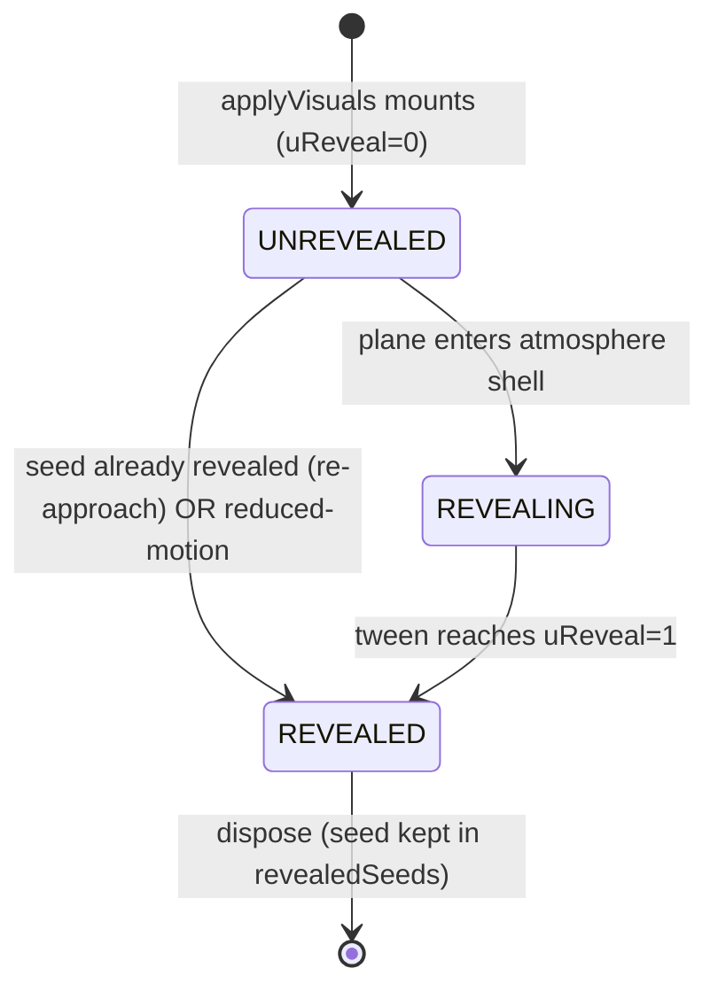

# Planet visuals Phase 5 — reveal-as-you-fly (atmosphere-gated)

## Overview

Phase 5 of the [planet-visuals workstream](./2026-05-23-001-feat-planet-visuals-llm-driven-assets-plan.md). Today, when Tier 2 resolves and GLBs finish loading, `Planet.applyVisuals` mounts every asset in a single frame — they just *pop* into existence. This phase makes the planet **reveal itself as you fly into it**: the surface stays a hazy, veiled sphere until the plane crosses into the atmosphere shell, at which point the hero + landmarks + surface scatter materialize with a smooth dither fade.

**Reveal trigger = atmosphere entry** (decided with the user, 2026-05-24). Assets still mount quietly when Tier 2 resolves (no change to the load path), but they're held at `uReveal = 0` — effectively invisible — until the plane penetrates the atmosphere, then the fade runs. This matches the brand promise ("each planet reveals itself as you close") and the player's stated instinct ("I like not really being able to see the surface until I'm in the atmosphere"). It also sidesteps magic kilometre thresholds: the atmosphere radius already scales per-planet.

Four workstreams:
- **A — Reveal shader.** A `uReveal`-driven dither-clip patched into the planet materials via `onBeforeCompile`. Material stays opaque (no transparency sort artifacts, works for `InstancedMesh`), and snaps to fully-solid on completion so the logbook thumbnail is clean.
- **B — Atmosphere + haze.** Fix the atmosphere shell **disappearing right before entry** (a `BackSide`-only rendering gap the player reported), and tint the existing altitude-driven `FogExp2` toward the biome sky so the pre-entry veil reads as atmosphere, not darkness.
- **D — Thumbnail-capture defer.** Gate the claim-time screenshot on "assets mounted + fade complete" (1.5s ceiling) so no half-revealed mesh lands in the logbook.
- **Warmup.** Prefetch GLBs + `renderer.compileAsync` the moment picks resolve, so the reveal frame never stalls on shader compile.

**Deferred (decided with the user):** sub-feature C — the heavy distance-gated mount/dispose state machine (mount hero at ~5km, dispose at ~6km, etc.) — is **out of scope**. The atmosphere-gated `uReveal` trigger delivers the felt "reveal as you fly" without unmount/remount churn. True distance-based *residency* folds into Phase 8 (performance: 2-system cap + distance-gated LOD), which already owns that concern.

## Problem Statement

1. **Assets pop in.** `Planet.applyVisuals` (`src/world/Planet.js`) awaits `Promise.all` of all hero/landmark/surface loads, then mounts everything in one `requestAnimationFrame` via `_replaceGroup` (the in-code comment even affirms "single-frame mount, no partial state"). On a slow Tier 2 the player watches procedural primitives, then a hard cut to fully-detailed GLBs. No materialization, no reveal beat.

2. **The surface is visible from space — backwards from the desired feel.** `scene.fog` is a `THREE.FogExp2` whose density is driven by altitude (`scene.fog.density = 0.00018 * r + 0.00004`, `main.js:735`, where `r` = atmosphere density 0→1). In space `r≈0` → density ≈ 0.00004 → ~25km visibility → you can see a planet's surface clearly from far out. The player wants the opposite: surface obscured until you're *in* the atmosphere.

3. **The atmosphere shell disappears right before entry.** `Atmosphere.js` renders the shell `side: THREE.BackSide` with a fresnel rim (`alpha = rim^2.2 * 0.55`). From outside you only ever see the far-limb rim ring; as you approach, the planet mesh occludes more of that backside shell and the rim collapses to a thin band, then nothing — until you're inside and it surrounds you. There's a visible window where the veil has vanished but you haven't entered. (Player-reported. Root cause to be confirmed by testing during implementation, but the BackSide-only geometry is the prime suspect.)

4. **The thumbnail can capture a half-built planet.** `thumbnailCapture.snapshotNow()` fires immediately on claim (`main.js:655`). If a player surveys to 100% before assets mount or while the fade is mid-dither, the logbook artifact — the player's *only* keepsake of that planet — freezes a half-transparent or procedural-primitive frame.

## Proposed Solution

### A — Reveal shader (`uReveal` dither-clip)

A single `onBeforeCompile` patch applied to every planet-mounted material (landmark clones + surface `InstancedMesh` materials), injecting a hash-dither `discard` gated by one `uReveal` uniform (0 → fully hidden, 1 → fully solid). The material stays **opaque** (`depthWrite: true`, normal opaque pass) — chosen over `transparent + opacity` because:

- Transparent + opacity depth-sorts per-object and breaks on clustered low-poly scatter (z-fighting, pop-swaps) and **cannot do per-instance opacity on `InstancedMesh`** (one shared material).
- Pure `alphaHash` solves sorting but reads grainy if the thumbnail is captured mid-reveal.
- The dither-clip keeps a single opaque pass during the reveal **and** snaps to a 100%-solid frame on completion (`uReveal = 1` → no discard) — giving a screenshot-clean final state that `alphaHash` can't.

`material.customProgramCacheKey = () => 'planetReveal'` so all reveal-patched materials share one compiled program (prevents the shader-program explosion the parent plan's research flagged; target < 25 distinct programs).

```js
// src/world/RevealMaterial.js (sketch)
// Patches a material in place to add a uReveal dither-clip. Returns the
// shared uniform ref so the planet can tween it. One program across all
// patched materials via the constant customProgramCacheKey.
export function patchReveal(material) {
  const uReveal = { value: 0 };
  material.onBeforeCompile = (shader) => {
    shader.uniforms.uReveal = uReveal;
    shader.fragmentShader = shader.fragmentShader
      .replace('#include <common>', `#include <common>
        uniform float uReveal;
        // 2D hash → [0,1); stable per-fragment screen position.
        float revealHash(vec2 p){ return fract(sin(dot(p, vec2(12.9898,78.233))) * 43758.5453); }`)
      .replace('#include <dithering_fragment>', `#include <dithering_fragment>
        if (uReveal < 1.0 && revealHash(gl_FragCoord.xy) > uReveal) discard;`);
  };
  material.customProgramCacheKey = () => 'planetReveal';
  material.needsUpdate = true;
  return uReveal;
}
```

For `InstancedMesh` surface scatter, the one shared material → one `uReveal` covers all instances (exactly the granularity we want — a planet reveals as a whole). No per-instance attribute needed unless we later want a stagger (then add an `aReveal` instanced float and offset the threshold).

**Two curves**, chosen at trigger time by `camera.position.distanceTo(planet.center)`:
- **Distant arrival** (player still on approach when the reveal fires): 500 ms, ease-out cubic.
- **Late arrival** (player already close / dropped straight in): 250 ms, ease-out cubic.

The sketch's "0.9 → 1.0 scale-up" is **dropped by default** — Phase 10 ground-snaps assets via `bbox.min.y`, so scaling from a centered origin lifts the base off the terrain mid-animation (the floating-tree bug). The faster curve alone disguises late pop-in. (Optional stretch: a hero-only, base-anchored scale; not in the core scope.)

### Reveal trigger = atmosphere entry

A per-planet reveal state machine, advanced in the render loop:

```
UNREVEALED ──(plane crosses into atmosphere shell)──▶ REVEALING ──(tween done)──▶ REVEALED
```

- Assets mount as today (on Tier 2 resolve + load), but `patchReveal` leaves them at `uReveal = 0` → invisible. The planet reads as a veiled sphere (atmosphere shell + fog).
- Each frame, `onRender(dt)` checks the active region's planets: when `atmosphere.contains(planePos)` first goes true (or the plane is within `atmosphere.radius` — entry edge), the planet transitions `UNREVEALED → REVEALING` and picks its curve.
- While `REVEALING`, advance `uReveal` by `dt / duration` (dt-driven so it pauses with the game and never runs faster than real time). On reaching 1, set `uReveal = 1` exactly and mark `REVEALED`.
- **Re-approach guard:** a module-level `revealedSeeds` Set (parallel to the existing `approachSent` seed-keying in `main.js`) records seeds that already revealed. A planet streamed out and back in mounts at `uReveal = 1` immediately — no annoying re-fade on every home-system flyby. (Set is keyed by seed, survives `Planet` disposal.)
- **prefers-reduced-motion:** skip the tween, mount/trigger straight to `uReveal = 1`.

### B — Atmosphere shell fix + fog tint

**B1 — Shell disappearing before entry.** Render the shell so the near veil is visible as the plane flies into it, not just the far-limb rim. Candidate fix (confirm by testing): switch `side: THREE.BackSide` → `THREE.DoubleSide` and drive alpha by **both** the fresnel rim **and** a proximity term (`alpha` thickens as the camera nears the shell), so approaching reads as flying into a thickening veil rather than a vanishing ring. Keep `depthWrite: false`, `transparent: true`. Validate from outside → entry → inside that there's no gap where the atmosphere is invisible.

**B2 — Fog tint toward biome sky.** Today `scene.fog.color` is hardcoded `0x05060a` (near-black). Drive it from the active planet's `palette.sky` (the same value `Atmosphere.tick` already reads) so the pre-entry veil reads as colored atmosphere. Keep the altitude-driven density curve. The fog is view-space (camera-relative) → floating-origin-safe by construction.

> Honest scoping note: the fog hiding the surface "from far away" is *not* the main lever — the reveal-gate (assets at `uReveal=0` until entry) does the real hiding. B2 is polish so the veil looks like sky, not a dark void. We will **not** invert the density curve to fog-out the surface from space (that would also fog the player's own cockpit view oddly); the reveal-gate is the correct mechanism.

### D — Thumbnail-capture defer

The claim path needs a readiness signal it can await. Today `applyVisuals` is fire-and-forget (`main.js:288` `.catch` only) and claim (`main.js:589`) has no handle on it. So:

- `Planet` exposes a small **readiness object**: `planet.reveal = { state, uReveal, mountedAt, assetsRequested, donePromise }`. `applyVisuals` sets `assetsRequested` (were any GLBs actually requested?) and resolves an internal "mounted" deferred when the mount lands; the reveal tween resolves `donePromise` on `REVEALED`.
- Claim path: `await Promise.race([Promise.all([assetsMounted, fadeComplete]), timeout(1500)])` then capture. On timeout (or if the fade is still running), **set `uReveal = 1` synchronously**, `await` one `requestAnimationFrame` (so the next `renderer.render` shows the solid frame — `snapshotNow` captures the *live* scene), then snapshot.
- **Procedural-claim case:** if no GLBs were requested (empty catalog / Tier 2 failed / not resolved yet), `assetsRequested === false` → capture immediately (the procedural primitives are the legitimate artifact; don't hang for assets that aren't coming).
- A brief **"Capturing…"** pill in the claim toast covers the ≤1.5s wait.

### Warmup (prefetch + compileAsync)

The moment Tier 2 picks resolve (`tryApproach`'s `.then`, `main.js:265-292`), kick off `AssetCache.load(url)` for all selected IDs (the promise-map dedupes, warming the cache `applyVisuals` reuses) and `renderer.compileAsync(scene, camera)` once the first clones exist, so the reveal frame never eats a ~75ms first-compile stall. `renderer.initTexture(tex)` on any GLB textures during the same window. (No post-processing/MRT in this renderer — the known `compileAsync`-before-composer breakage doesn't apply; guarded with a comment in case Phase 9+ adds post FX.)

## Technical Approach

### Architecture

```
src/world/RevealMaterial.js   (NEW) — patchReveal(material) → { value }; constant cache key
src/world/Planet.js           — applyVisuals patches reveal on mounted mats (uReveal=0);
                                 new planet.reveal state obj; tickReveal(dt, planePos, camera);
                                 re-mount snaps to uReveal=1 if seed already revealed
src/world/Atmosphere.js       — DoubleSide + proximity-driven alpha (B1); expose nothing new
src/main.js                   — onRender: advance reveal for loaded planets via galaxy.allPlanets();
                                 fog.color ← active palette.sky (B2);
                                 tryApproach: prefetch + compileAsync warmup;
                                 claim: gate snapshotNow on planet.reveal readiness (D) + "Capturing…" pill
src/world/Galaxy.js           — (reuse) allPlanets() generator for per-frame reveal tick
```



### Reveal tick lifecycle (SpecFlow-driven)

- **Tick ALL loaded planets, not just the active one.** A planet typically begins revealing *as* the plane crosses its shell, which is the same moment it becomes active — but a fast approach or a planet whose shell the plane clips can start revealing slightly before the active-planet swap. Advancing the tween only for `activePlanet` would freeze a reveal mid-dither and snap it on the swap. So `onRender(dt)` iterates `galaxy.allPlanets()` and advances any planet in `REVEALING`. Cost is trivial (a float add + uniform write per revealing planet; revealed/unrevealed planets are skipped).
- **dt-driven, not wall-clock** — pauses correctly with `loop` pause; never overruns real time.
- **`visualGen` interaction:** single-mount is preserved (C deferred), so the existing two gen-checks (after loads, after rAF) are sufficient. The reveal tween reads `this.reveal` which is reset on each `applyVisuals`; a despawn nulls it via `dispose()`.

### Failure modes & resilience

- **Plane never enters the atmosphere (flyby).** Planet stays `UNREVEALED` (veiled sphere) and is streamed out normally. No reveal cost paid. Correct — the player chose not to visit.
- **Slow Tier 2, player already inside the shell when assets mount.** Mount detects `atmosphere.contains(planePos)` is already true → transition straight to `REVEALING` with the **late** (250ms) curve. The player sees a quick materialization rather than a freeze.
- **Claim before assets mount.** `assetsRequested === false` (or mount deferred unresolved) → procedural capture, no hang (1.5s ceiling is the backstop).
- **Swerve away mid-reveal.** Planet streams out → `dispose()` (bumps `visualGen`, nulls `reveal`). The seed is *not* added to `revealedSeeds` unless the reveal completed, so a genuine return re-reveals; a completed reveal that streams out and back snaps to solid.
- **compileAsync on a planet that despawns before mount.** The promise resolves into a no-op (gen check on mount drops it); compiled programs are harmless cache warmth.
- **Reduced motion.** Straight to `uReveal = 1`; no dither animation.

## Alternative Approaches Considered

| Approach | Why rejected |
|---|---|
| **`transparent: true` + opacity tween** | Depth-sort artifacts on clustered low-poly scatter; cannot do per-instance opacity on `InstancedMesh`; doubles draw cost during fade. |
| **Pure `alphaHash` dissolve** | Solves sorting and is per-instance-free, but reads grainy — a thumbnail captured mid-reveal would be stippled. The custom dither-clip snaps to a clean opaque final frame. |
| **Absolute-distance reveal (hero@5km, surface@1km)** | Magic thresholds that don't scale per-planet; needs the full distance-gated mount/dispose machine. Atmosphere-entry gating is cleaner and matches the player's mental model. *(User decision, 2026-05-24.)* |
| **Sub-feature C: distance-gated mount/dispose with hysteresis** | High risk, overlaps Phase 8 (2-system cap + distance LOD), adds per-stage `visualGen` cancellation complexity. The reveal-gate delivers the feel without residency churn. *Deferred to Phase 8.* |
| **Invert the fog density curve to hide the surface from space** | Would fog the player's near view oddly and fight the cockpit readability. The `uReveal` gate is the correct surface-hiding mechanism; fog stays atmospheric polish. |
| **Fix the atmosphere shell with a full-screen scattering post-pass** | Overkill for the reported bug; introduces a post-processing pipeline (and the `compileAsync`+MRT breakage risk). DoubleSide + proximity alpha is a one-file fix. |

## System-Wide Impact

### Interaction graph

```
tryApproach(planet).then(meta)                       [main.js ~265]
  → planet.applyLLM(meta)                             (palette/names — existing)
  → prefetch: AssetCache.load(url) × selectedIds      (NEW — warms cache)
  → renderer.compileAsync(scene, camera)              (NEW — warms shaders)
  → planet.applyVisuals({...})                        (existing; now patches uReveal=0 on mounted mats)
        → patchReveal(material) per cloned material + per InstancedMesh material
        → planet.reveal = { state: UNREVEALED, uReveal:{value:0}, ... }
        → if revealedSeeds.has(seed) → uReveal=1, state=REVEALED  (re-approach snap)

onRender(dt)                                          [main.js ~725]
  → for {planet, atmosphere} of galaxy.allPlanets():
        if planet.reveal?.state === REVEALING: advance uReveal by dt; on done → REVEALED + resolve donePromise
        else if UNREVEALED && atmosphere.contains(planePos): state=REVEALING; pick curve by camera.distanceTo(center); on entry add seed→revealedSeeds when complete
  → fog.color ← activePlanet.palette.sky              (B2)
  → activeAtmosphere.tick(); fog.density = f(r)       (existing)

claim(planet)                                         [main.js ~589]
  → markClaimed + logbook (existing)
  → thumbnail: await race([all([assetsMounted, fadeComplete]), 1500ms])
        on timeout/incomplete → uReveal=1 sync; await 1 rAF
        → thumbnailCapture.snapshotNow()              (D)
  → "Capturing…" pill in claim toast
```

### State lifecycle risks

- **`revealedSeeds` unbounded growth.** Cap with the same posture as other per-seed sets, or accept it (one int per visited planet; thousands is negligible). Spec: cap at ~500 via FIFO if needed.
- **Reveal materials disposal.** `_replaceGroup` disposes `material.userData.cloned` materials (the reveal-patched ones qualify). The shared `'planetReveal'` program is refcounted by three.js per cache key — two planets mid-reveal won't free each other's program; the program frees when the last patched material disposes. *Verify with `renderer.info.programs` in dev.*
- **`planet.reveal` null after dispose.** All readers (`onRender` tick, claim gate) must null-check `planet.reveal?.` — a despawn between frames nulls it.

### Integration test scenarios

1. **Slow Tier 2, fly straight in.** Approach a fresh planet; assets mount while the plane is still outside the shell (uReveal=0, veiled). Cross the shell → 250ms (late) fade. No freeze, no pop. Atmosphere veil visible through approach → entry (B1).
2. **Distant reveal.** Drift toward a planet slowly; cross the shell from far/high → 500ms (distant) fade.
3. **Flyby, no entry.** Pass a planet without entering its shell → it stays a veiled sphere, never reveals, streams out cleanly.
4. **Claim mid-fade.** Survey to 100% while uReveal≈0.6 → thumbnail waits, forces uReveal=1, captures a solid frame. Logbook entry has no half-transparent meshes.
5. **Claim on procedural (empty catalog / slow Tier 2).** Survey 100% before GLBs mount → thumbnail captures procedural visuals immediately, no 1.5s hang.
6. **Re-approach.** Reveal a home-system planet, fly out, fly back → it's solid immediately (no re-fade).
7. **Reduced motion.** With `prefers-reduced-motion`, assets appear solid on atmosphere entry with no dither animation.

## Acceptance Criteria

### Functional

- [x] New `src/world/RevealMaterial.js` `patchReveal(material)` injects a `uReveal` dither-clip via `onBeforeCompile`, keeps the material opaque, and sets `customProgramCacheKey = () => 'planetReveal'`.
- [x] `applyVisuals` patches every mounted landmark + surface material to `uReveal = 0` on mount; hero opt-out behavior from Phase 10 is preserved (reveal still applies to whatever material the hero ends up with).
- [x] Assets are invisible (`uReveal = 0`) until the plane enters the atmosphere shell, then fade in. *(Verified: forced-hidden uReveal=0; triggers only when atmosphere.contains is true.)*
- [x] Two curves: distant (≥ threshold) = 500ms ease-out; late (< threshold) = 250ms ease-out; chosen at trigger time from altitude fraction within the shell. *(Verified: top-entry→500ms, low-entry→250ms.)*
- [x] Reveal advances dt-driven in `onRender` for **all** loaded planets (via `galaxy.allPlanets()`), not just the active one; pauses with the game loop.
- [x] `uReveal` snaps to exactly 1 on completion (clean opaque final frame). *(Verified: mid-fade 0.588 → completed all-solid.)*
- [x] Re-approaching an already-revealed seed mounts solid (no re-fade); `revealedSeeds` records completed reveals and survives `Planet` disposal. *(Verified: re-applyVisuals mounted REVEALED+solid.)*
- [x] `prefers-reduced-motion` → assets appear solid on entry, no dither tween. *(Same snap branch as re-approach; verified the snap produces solid.)*
- [~] **B1 — DROPPED from this phase.** The DoubleSide + proximity-fill approach regressed the look the player liked (tight "wrapped" rim → diffuse halo). Reverted to the original `BackSide` shell. The "atmosphere disappears right before entry" annoyance needs a look-preserving fix; revisit separately. (User decision, 2026-05-24.)
- [x] **B2:** `scene.fog.color` tints toward the active planet's `palette.sky`; altitude density curve unchanged.
- [x] **D:** claim-time `snapshotNow()` waits on assets-mounted + fade-complete (1.5s ceiling); on timeout it sets `uReveal = 1` synchronously, awaits one rAF, then captures; "Capturing…" pill shown.
- [x] **D procedural case:** claim with no GLBs requested (`planet.reveal === null`) captures immediately (no hang) — guard verified by inspection.
- [x] **Warmup:** prefetch `AssetCache.load` + `renderer.compileAsync` fire on Tier 2 resolve.

### Non-functional

- [ ] Distinct shader programs stay < 25 (the reveal patch shares one program via the cache key); verify via `renderer.info.programs` in dev.
- [ ] No measurable FPS regression on a revealed planet vs today (the reveal tween is a per-frame float add + uniform write).
- [ ] No first-reveal-frame stall (compileAsync warmup); reveal looks smooth at 60fps.
- [ ] Reveal materials dispose cleanly on planet despawn (no `renderer.info.programs` / `.memory` growth across 10 approach/despawn cycles).

### Quality gates

- [x] Reveal state-machine scenarios verified in dev via `__GAME` introspection (hidden→trigger→fade→solid, distant/late curves, re-approach snap, done-promise). Live fly-through visual + thumbnail-in-real-flight deferred to post-deploy (needs the live LLM worker).
- [ ] Logbook thumbnail of a revealed planet shows fully-solid assets (no dither/transparency). *(Deferred to post-deploy — needs a real claim against the live worker.)*
- [x] `npm run build` clean.
- [ ] Distinct shader programs < 25 / no program-or-memory growth across approach-despawn cycles. *(Deferred to post-deploy — couldn't read `renderer.info` from the test harness.)*

## Success Metrics

- **Felt reveal:** approaching a planet shows a veiled sphere that materializes on atmosphere entry — no hard pop, no half-built thumbnail. (Qualitative, the core goal.)
- **Atmosphere continuity:** the shell never visibly disappears before entry (the reported bug is gone).
- **Thumbnail integrity:** 100% of claimed-planet thumbnails show solid assets (spot-check 10).
- **No perf/program regression:** `renderer.info.programs` stable; 60fps maintained.

## Dependencies & Prerequisites

- Phase 4 (`applyVisuals`, `visualGen`, `_replaceGroup`) — shipped.
- Phase 10 (`MaterialSet`/`ColorSystem` per-mesh materials, `bbox` ground-snap) — shipped; the reveal patch wraps these materials, and ground-snap is why the scale-up is dropped.
- Three.js r184 — `onBeforeCompile(shader, renderer)`, `customProgramCacheKey` (defaults to `onBeforeCompile.toString()`; we override to a constant), `renderer.compileAsync(scene, camera)` (returns a Promise), `renderer.initTexture(texture)`, `FogExp2` (view-space depth, floating-origin-safe). All verified present in the installed `node_modules/three@0.184.0`.

## Risk Analysis & Mitigation

| Risk | Severity | Mitigation |
|---|---|---|
| **Atmosphere shell fix (B1) root cause is not the BackSide gap** | Medium | Confirm by testing before committing to DoubleSide; the fix is isolated to `Atmosphere.js`. If it's a culling/clip issue instead, address that — the AC is "shell visible through entry," not a specific mechanism. |
| **Dither reveal reads noisy on flat-shaded low-poly** | Low | It's only visible *during* the 250-500ms tween; final frame is solid. If too noisy, swap the hash dither for a smooth vertical wipe in the same `uReveal` patch (one-line shader change). |
| **Shader-program explosion from per-planet patched materials** | Medium | Constant `customProgramCacheKey = () => 'planetReveal'` shares one program; verified < 25 programs in dev as an AC. |
| **Reveal tween freezes for non-active planets** | Medium | Tick all loaded planets via `galaxy.allPlanets()`, not just `activePlanet` (SpecFlow finding). |
| **Thumbnail forces `uReveal=1` a frame too late** | Low | Set the uniform synchronously and `await` one rAF before `snapshotNow` (which renders the live scene). |
| **Re-fade churn on home-system flybys** | Low | `revealedSeeds` snap-to-solid on re-approach. |
| **compileAsync + future post-processing breakage** | Low | No post FX today; guarded with a comment to revisit if Phase 9 adds a composer. |

## Resource Requirements

- **Time:** ~2-3 days solo. A (reveal shader + trigger + tick) is the bulk (~1.5d); B (atmosphere fix + fog tint) ~0.5d; D (thumbnail defer) ~0.5d; warmup ~0.25d.
- **Costs:** none (all client-side rendering).
- **External:** none.

## Future Considerations

- **Sub-feature C (distance-gated residency)** — folds into Phase 8: mount/dispose by distance with hysteresis + the 2-system cap. The `uReveal` infra here is forward-compatible (C would just mount at distance and reveal on entry as now).
- **Per-instance reveal stagger** — an `aReveal` instanced float for a "scatter blooms outward" effect. Cosmetic; skip for v1.
- **Hero-only base-anchored scale-up** — the dropped scale beat, done safely. Revisit if late-arrival reveals still feel abrupt.
- **WebGPU migration** — port the `onBeforeCompile` dither to a TSL node `discard` if/when the renderer changes.

## Documentation Plan

- This plan: `docs/plans/2026-05-24-002-feat-planet-visuals-phase-5-reveal-as-you-fly-plan.md`.
- Update parent plan progress table (Phase 5 row) to reference this sub-plan + PR, and note C deferred to Phase 8.
- JSDoc on `patchReveal` + the `planet.reveal` state object.

## Sources & References

### Origin
- **Parent plan:** `docs/plans/2026-05-23-001-feat-planet-visuals-llm-driven-assets-plan.md` — Phase 5 section (lines 685-703) + research insights (lines 416-462 cohesion/shader-program, 754-823 performance/warmup/distance-gating). Intent gate already shipped (#14).
- **User decisions (2026-05-24):** reveal trigger = atmosphere entry (not absolute distance); defer sub-feature C; bundle the atmosphere-shell-disappearing fix into this phase; "can't see the surface until you're in the atmosphere."
- **Research synthesis (this turn):** four parallel agents (repo ground truth, learnings, external Three.js reveal/fog best practices, r184 API verification) + SpecFlow gap analysis.

### Internal references
- Mount path: `src/world/Planet.js` (`applyVisuals` Promise.all + single-rAF mount, `_replaceGroup` dispose-by-`userData.cloned`, `visualGen`).
- Materials: `src/world/MaterialSet.js` `applyMaterialSet` (per-mesh `MeshLambertMaterial`, `userData.cloned=true`); surface `InstancedMesh` shares one material (`src/world/Features.js`).
- Atmosphere shell: `src/world/Atmosphere.js` (BackSide fresnel rim, `contains()`, `density()`, `tick()`).
- Fog + render loop: `src/main.js:71` (`FogExp2`), `:725-737` (`onRender`, fog density), `:655` (thumbnail call), `:589` (claim), `:265-292` (tryApproach pick resolve); `src/game/GameLoop.js` (dt-providing loop).
- Planet iteration: `src/world/Galaxy.js` `allPlanets()` generator.
- Thumbnail: `src/logbook/ThumbnailCapture.js` `snapshotNow()`.

### External references
- [Material.onBeforeCompile uniform injection (three.js #11475)](https://github.com/mrdoob/three.js/issues/11475)
- [onBeforeCompile docs](https://threejs.org/docs/#api/en/materials/Material.onBeforeCompile) · [Material.alphaHash](https://threejs.org/docs/#api/en/materials/Material.alphaHash)
- [InstancedMesh per-instance opacity not supported (discourse)](https://discourse.threejs.org/t/opacity-for-instancedmesh/42239)
- [Three.js Fog Hacks — Belkhale](https://snayss.medium.com/three-js-fog-hacks-fc0b42f63386) · [Fog manual](https://threejs.org/manual/en/fog.html) · [FogExp2 docs](https://threejs.org/docs/pages/FogExp2.html)
- [WebGLRenderer.compileAsync](https://threejs.org/docs/#api/en/renderers/WebGLRenderer.compileAsync) · [initTexture](https://threejs.org/docs/#api/en/renderers/WebGLRenderer.initTexture)
- [compileAsync shader-compile stutter (discourse)](https://discourse.threejs.org/t/reducing-shader-compile-time-on-scene-initialization/56572) · [compileAsync + MRT breakage (#31220)](https://github.com/mrdoob/three.js/issues/31220)
- [LOD hysteresis (#14565)](https://github.com/mrdoob/three.js/issues/14565) — informs the deferred C
- [three.js r184 release notes](https://github.com/mrdoob/three.js/releases/tag/r184)

### Related work
- Phase 10 (placement + dual-axis color): PR #15. Phase 6 (diversity + cohesion): PR #16.
